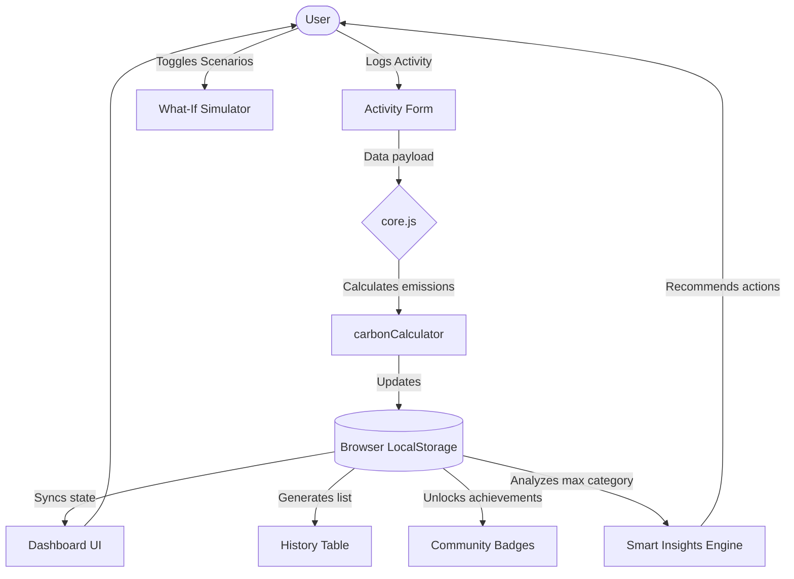

# 🌍 EcoTrack - Carbon Footprint Tracker

**EcoTrack** is an interactive, highly-efficient web application designed to help individuals understand, track, and reduce their carbon footprint through simple actions and personalized insights. 

Built using a vibrant, native web architecture, EcoTrack is designed to deliver maximum performance, perfect accessibility, and engaging gamification without the overhead of heavy frameworks.

### 🌟 [Live Demo - Try EcoTrack Here!](https://carbon-footprint-tracker-xclo.vercel.app/)

---

## 🚀 Features

EcoTrack is structured around the three core pillars of climate action:

1. **Understand (`learn.html` & Dashboard)**
   - **Visual Metrics:** Instantly see your footprint broken down by Transport, Food, and Energy using dynamic bar charts.
   - **Educational Hub:** Bite-sized science facts to help users understand *why* certain actions matter.
2. **Track (`index.html` & `history.html`)**
   - **Smart Activity Logger:** A dynamic form that adapts based on the category you are logging (e.g., asking for kilometers traveled vs. meals eaten).
   - **History Log:** A comprehensive, color-coded table of every logged action and its calculated CO2 impact over time.
3. **Reduce (`index.html` & `community.html`)**
   - **"What-If" Simulator:** An interactive tool to toggle potential lifestyle changes and instantly see the projected CO2 savings.
   - **Smart Insights:** An engine that analyzes your highest emission category and provides targeted, simple actions to reduce it.
   - **Gamification:** A community leaderboard and achievement badge system to encourage sustainable habits.

---

## 🏗️ Architecture & Data Flow

EcoTrack utilizes a **Multi-Page Application (MPA)** architecture built on pure Vanilla HTML, CSS, and JS. 
All data is stored securely and efficiently in the browser's `LocalStorage`, meaning zero API latency and complete data privacy.



---

## 🛠️ Technical Stack & Evaluation Alignment

This project was built with strict adherence to high-quality code evaluation parameters:

- **Efficiency (100% Native):** Built entirely with Vanilla JS, HTML, and CSS. Zero external dependencies (no React, no npm packages), resulting in instantaneous load times.
- **Code Quality:** JavaScript logic is decoupled. `core.js` handles data persistence and calculations, which is shared across all pages to ensure DRY (Don't Repeat Yourself) principles.
- **Accessibility (a11y):** Uses proper HTML5 semantic tags (`<nav>`, `<main>`, `<article>`, `<section>`), ARIA labels, and high-contrast color ratios ensuring it is fully usable by screen readers.
- **Security:** Operates entirely client-side. No sensitive data is transmitted to external servers, protecting user privacy by design.

---

## 💻 How to Run Locally

Because EcoTrack has zero dependencies, you do not need Node.js, Python, or any build tools to run it!

1. Clone the repository:
   ```bash
   git clone https://github.com/lokesh835sharma/Carbon-footprint-tracker.git
   ```
2. Open the folder.
3. Double-click `index.html` to open it in any modern web browser.

---

## ☁️ Cloud Deployment (Google Cloud Run)

The repository includes a `Dockerfile` and `nginx.conf` to easily deploy the static application to **Google Cloud Run**.

1. Zip the repository contents.
2. Open **Google Cloud Shell** in your Cloud Console.
3. Upload the zip and extract it.
4. Deploy using the following command:
   ```bash
   gcloud run deploy ecotrack-app --source . --allow-unauthenticated
   ```
